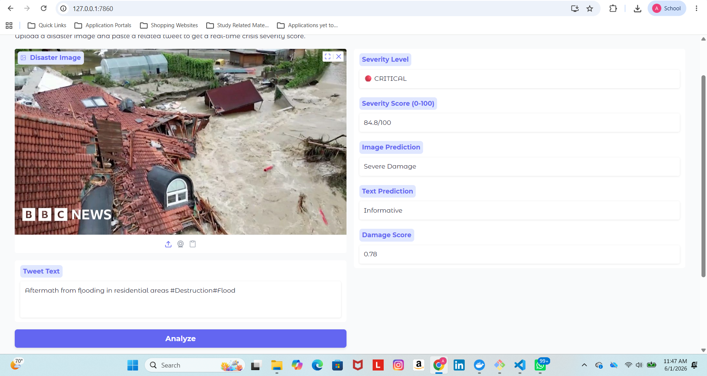

# 🌍 DisasterSense
### Multimodal Disaster Detection & Severity Scoring System

A production-ready AI system that classifies disaster images and social media text, fuses both signals into a real-time crisis severity score, served via REST API and monitored on a live Metabase dashboard.

---

## Demo



**Severity: 84.8/100 — 🔴 CRITICAL** | Image: Severe Damage | Text: Informative

---

## Architecture

```
[Disaster Image] ──→ [EfficientNet-B0] ──→ damage_score
                                                  ↓
                                          [Fusion Layer] ──→ Severity Score (0–100)
                                                  ↑
[Tweet Text]     ──→ [twitter-roberta] ──→ informative_score
                              ↓
                         [FastAPI]
                              ↓
                       [PostgreSQL]
                              ↓
                    [Metabase Dashboard]
```

---

## Results

| Model | Task | Accuracy |
|---|---|---|
| EfficientNet-B0 | Damage Severity (3-class) | 64% |
| twitter-roberta-base | Informative Classification | 75% |
| Fusion System | Crisis Severity Score | 0–100 scale |

### Model Improvement
| Version | Val Accuracy | Changes |
|---|---|---|
| Baseline | 58.22% | Frozen backbone, 15 epochs |
| Improved | 64.27% | Unfrozen last 3 blocks, differential LR, 20 epochs |

---

## Tech Stack

| Component | Tool |
|---|---|
| Image Classifier | EfficientNet-B0 (PyTorch) |
| NLP Classifier | twitter-roberta-base (HuggingFace) |
| Fusion Layer | Weighted scoring (60% image, 40% text) |
| API | FastAPI + Uvicorn |
| Database | PostgreSQL |
| Dashboard | Metabase |
| Demo UI | Gradio |
| Containerization | Docker + docker-compose |

---

## Dataset

**CrisisMMD v2.0** (Alam et al., 2018)
- 7 real disaster events: Hurricane Harvey, Irma, Maria, Iraq-Iran Earthquake, Mexico Earthquake, Sri Lanka Floods, California Wildfires
- 3,526 labeled images for damage severity classification
- 13,608 labeled tweets for informative classification
- Labels: severe_damage, mild_damage, little_or_no_damage

---

## API Endpoints

| Method | Endpoint | Description |
|---|---|---|
| GET | `/` | API status |
| GET | `/health` | Model + DB health check |
| POST | `/predict` | Multimodal severity prediction |
| GET | `/predictions` | Last 50 logged predictions |
| GET | `/labels` | Available classes and thresholds |

### Sample Response
```json
{
  "prediction_id": "67f9543bf6514866a6a36c52d08aba1d",
  "timestamp": "2026-05-31T03:30:42.910005",
  "image_prediction": "severe_damage",
  "damage_score": 0.8302,
  "text_prediction": "informative",
  "informative_score": 0.6928,
  "severity_score": 77.52,
  "severity_level": "CRITICAL",
  "inference_time_ms": 198.04
}
```

---

## Severity Levels

| Level | Score Range | Meaning |
|---|---|---|
| 🟢 LOW | 0–20 | Minimal damage, low social signal |
| 🟡 MODERATE | 20–45 | Some damage detected |
| 🟠 HIGH | 45–70 | Significant damage, active reporting |
| 🔴 CRITICAL | 70–100 | Severe damage, high social activity |

---

## Running Locally

### Option 1 — Docker (recommended)
```bash
git clone https://github.com/Asmita1109/disastersense.git
cd disastersense
docker-compose up
```
API live at `http://localhost:8000`

### Option 2 — Manual
```bash
git clone https://github.com/Asmita1109/disastersense.git
cd disastersense
python -m venv venv
source venv/Scripts/activate  # Windows
pip install -r requirements.txt
uvicorn api.main:app --reload
```

### Demo UI
```bash
python app.py
# Open http://127.0.0.1:7860
```

---

## Project Structure

```
disastersense/
├── notebooks/
│   └── eda.py                 # Exploratory data analysis
├── src/
│   ├── preprocess.py          # Image transforms and dataloaders
│   ├── train.py               # EfficientNet-B0 fine-tuning
│   ├── nlp_preprocess.py      # Tweet tokenization and dataloaders
│   ├── nlp_train.py           # twitter-roberta fine-tuning
│   ├── fusion.py              # Multimodal fusion layer
│   └── batch_predict.py       # Batch inference script
├── api/
│   └── main.py                # FastAPI application
├── outputs/
│   ├── eda/                   # EDA charts and model results
│   ├── api/                   # API response screenshots
│   ├── dashboard/             # Metabase dashboard export
│   └── demo/                  # Gradio demo screenshots
├── app.py                     # Gradio demo interface
├── Dockerfile
├── docker-compose.yml
└── requirements.txt
```

---

## Known Limitations

- NLP model shows slight bias toward `informative` class due to class imbalance (8,341 vs 5,267 samples)
- Image model trained on CPU with limited epochs — higher accuracy achievable with GPU
- 72% of training data from hurricane events — model may generalize less well to earthquake or flood imagery

---

## Future Scope

- Weighted cross-entropy loss to reduce NLP model bias
- Real-time Twitter/X stream ingestion via Tweepy or Kafka
- Full EfficientNet fine-tuning on GPU for higher accuracy
- Geographic clustering of predictions on a live map
- Multi-language support for global disaster response
- Active learning pipeline for continuous model improvement

---

## References

Alam, F., Ofli, F., & Imran, M. (2018). CrisisMMD: Multimodal Twitter Datasets from Natural Disasters. *ICWSM 2018*.
